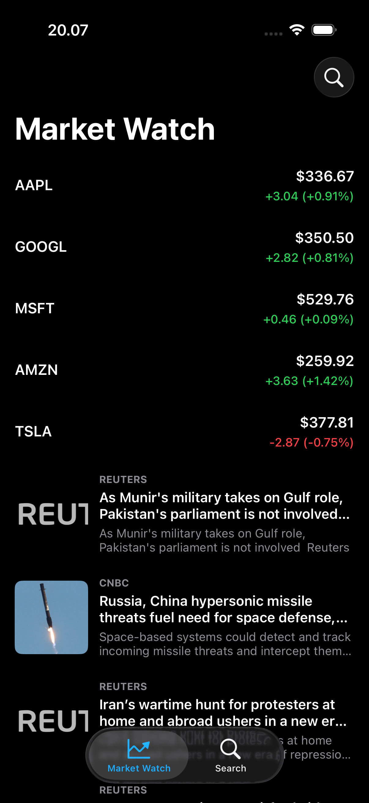
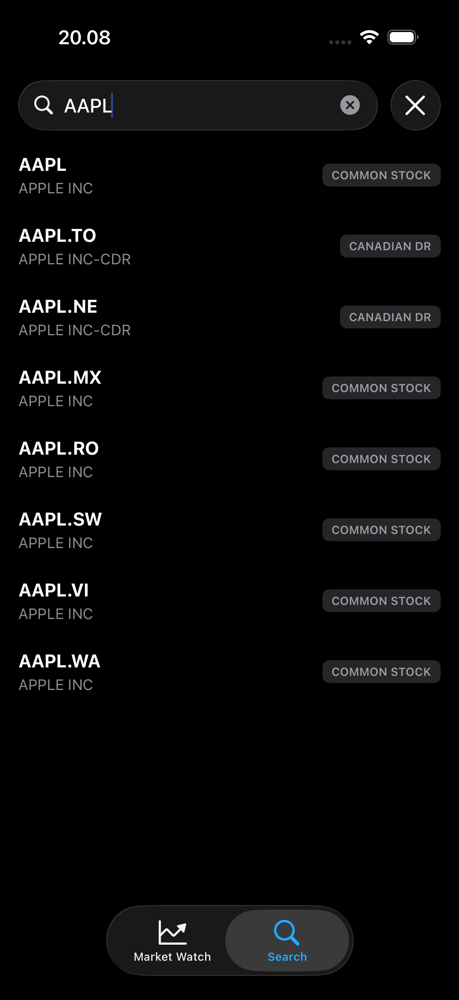
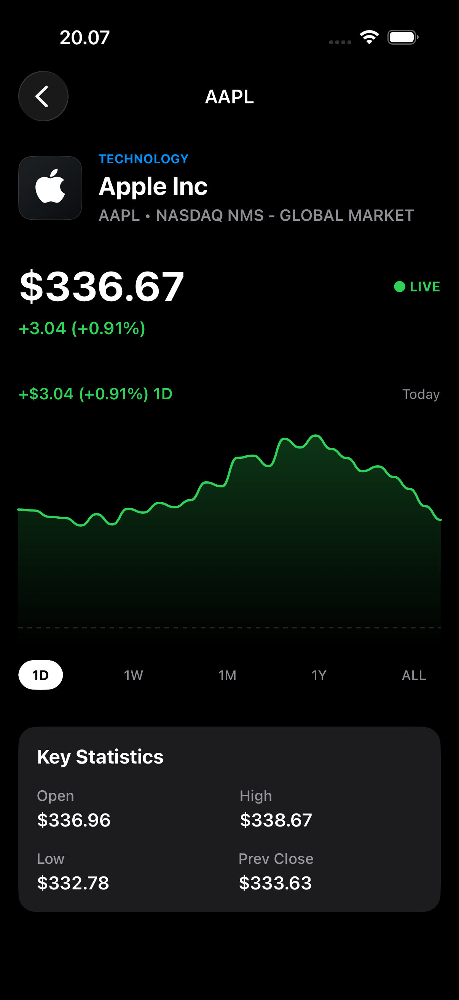

# MarketApp

An iOS stock market app built with a modular, test-driven architecture. It shows a market feed (quotes and news), stock search, and a stock detail screen with a chart and live trade prices streamed over WebSocket. Data comes from the [Finnhub](https://finnhub.io) API.

## Demo

| Home | Search | Detail |
| --- | --- | --- |
|  |  |  |

## Features

- **Feed**: stock quotes and market news.
- **Search**: look up stocks by symbol or name.
- **Detail**: company profile, key metrics, price chart with selectable timeframes, and live trade updates.

## Architecture

The project is split into three layers with one-way dependencies (`MarketApp` → `MarketPresentation` / `MarketCore`).

| Module | Responsibility | Dependencies |
| --- | --- | --- |
| `MarketCore` | Domain entities, loader and service protocols, remote loaders, HTTP and WebSocket clients | Foundation only |
| `MarketPresentation` | View models (`MarketFeedViewModel`, `StockSearchViewModel`, `StockDetailViewModel`, `LiveMarketStreamViewModel`) | RxSwift, RxRelay (no UIKit or RxCocoa) |
| `MarketApp` | UI: Texture nodes, IGListKit section controllers, view controllers | Texture, IGListKit, RxCocoa |

Composition lives in `MarketApp/Composition` (`AppComposer` and one UI composer per feature). It wires the concrete clients, loaders, view models and view controllers together.

```
MarketApp/
├── MarketApp/                    # UI app target (Texture + IGListKit)
│   ├── Application/              # AppDelegate, SceneDelegate, assets
│   ├── Composition/              # Dependency wiring
│   │   ├── AppComposer.swift             # Root: builds the tab bar and holds baseURL/token
│   │   ├── FeedUIComposer.swift
│   │   ├── StockSearchUIComposer.swift
│   │   └── StockDetailUIComposer.swift
│   └── Features/
│       ├── Main/
│       │   └── Controllers/      # MainTabBarController
│       ├── Feed/
│       │   ├── Controllers/      # MarketFeedViewController
│       │   ├── SectionControllers/   # StockQuote / MarketNews section controllers
│       │   ├── Models/           # IGListKit diffable models
│       │   └── Nodes/            # StockQuoteCellNode, MarketNewsCellNode
│       ├── Search/
│       │   ├── Controllers/      # StockSearchViewController
│       │   ├── SectionControllers/   # SearchResult / SearchState section controllers
│       │   ├── Models/           # Diffable models (results, empty/loading state)
│       │   └── Nodes/            # SearchResultCellNode, SearchStateCellNode
│       └── Detail/
│           ├── Controllers/      # StockDetailViewController
│           └── Nodes/            # Header, price, metrics, scroll, and chart nodes
│                                 # (StockChartNode, CanvasNode, Timeframe, DataPoint, HistoryGenerator)
├── MarketCore/                   # Framework: no UI, Foundation only
│   ├── Domain/
│   │   ├── Entities/             # Plain models
│   │   │   ├── StockQuoteModel.swift
│   │   │   ├── SearchResultModel.swift
│   │   │   ├── MarketNewsModel.swift
│   │   │   ├── CompanyProfileModel.swift
│   │   │   └── LiveTradeModel.swift
│   │   └── Interfaces/           # Protocols the app depends on
│   │       ├── MarketFeedLoader.swift
│   │       ├── StockSearchLoader.swift
│   │       ├── StockDetailLoader.swift
│   │       └── LiveMarketStreamService.swift
│   ├── Services/                 # Finnhub-backed implementations of the interfaces
│   │   ├── RemoteMarketFeedLoader.swift
│   │   ├── RemoteStockSearchLoader.swift
│   │   ├── RemoteStockDetailLoader.swift
│   │   └── RemoteLiveMarketStreamService.swift
│   └── Infrastructure/           # Networking abstractions and URLSession implementations
│       ├── HTTP/
│       │   ├── HTTPClient.swift
│       │   └── URLSessionHTTPClient.swift
│       ├── WebSocket/
│       │   ├── WebSocketClient.swift
│       │   ├── WebSocketSession.swift
│       │   └── URLSessionWebSocketClient.swift
│       └── Helpers/
│           └── URL+QueryItems.swift
├── MarketPresentation/           # Framework: presentation logic, RxSwift/RxRelay only
│   ├── ViewModelType.swift       # Input/Output protocol shared by all view models
│   ├── MarketFeedViewModel.swift
│   ├── StockSearchViewModel.swift
│   ├── StockDetailViewModel.swift
│   └── LiveMarketStreamViewModel.swift
├── MarketCoreTests/
│   ├── Infrastructure/           # URLSessionHTTPClient / WebSocketClient tests
│   ├── Services/                 # Remote loader/service tests + HTTPClientSpy
│   └── Helpers/                  # Shared XCTest helpers
├── MarketPresentationTests/      # One test file per view model
├── MarketAppTests/
└── MarketAppUITests/
```

### MarketCore

Each layer only knows the one below it.

| Layer | Role |
| --- | --- |
| **Domain** | Entities describe the data (quotes, news, search results, company profile, live trades). Interfaces (`MarketFeedLoader`, `StockSearchLoader`, `StockDetailLoader`, `LiveMarketStreamService`) define what the app needs, with no knowledge of Finnhub or URLSession. |
| **Services** | `Remote*` classes implement the domain interfaces. They build Finnhub URLs (adding the `token` query item), call an `HTTPClient` or `WebSocketClient`, decode private DTOs, and map them to domain entities. |
| **Infrastructure** | `HTTPClient` and `WebSocketClient` are small protocols. `URLSessionHTTPClient` and `URLSessionWebSocketClient` are the concrete versions, and `WebSocketSession` abstracts the underlying socket task. `URL+QueryItems` is a helper for building query strings. |

Because services depend on the `HTTPClient` and `WebSocketClient` protocols, tests can inject spies such as `HTTPClientSpy` and never touch the network.

### MarketPresentation

- Each view model conforms to `ViewModelType`, which maps `Input` (user actions and lifecycle events) to `Output` (state for the UI).
- View models depend only on the `MarketCore` domain interfaces, so they work with any implementation of them.
- They use RxSwift and RxRelay only. There is no UIKit or RxCocoa, so the logic can be tested without a UI.

| View model | Drives |
| --- | --- |
| `MarketFeedViewModel` | Feed screen: loads quotes and news |
| `StockSearchViewModel` | Search screen: queries and results |
| `StockDetailViewModel` | Detail screen: company profile and metrics |
| `LiveMarketStreamViewModel` | Live trade prices streamed over WebSocket |


## Tech Stack

- Swift, UIKit, iOS 17.0+
- [Texture](https://texturegroup.org) (AsyncDisplayKit) for async UI nodes
- [IGListKit](https://github.com/Instagram/IGListKit) 5 for diffable lists
- [RxSwift / RxRelay / RxCocoa](https://github.com/ReactiveX/RxSwift) 6.8+
- RxTest and RxBlocking for testing
- CocoaPods for dependency management

## Getting Started

### Requirements

- Xcode (recent version with an iOS 17+ SDK)
- [CocoaPods](https://cocoapods.org) (`1.16.2` was used)
- A free [Finnhub API key](https://finnhub.io/register)

### Setup

1. Install the dependencies:
   ```bash
   pod install
   ```
2. Open the workspace, not the project:
   ```bash
   open MarketApp.xcworkspace
   ```
3. Add your Finnhub token in [AppComposer.swift](MarketApp/Composition/AppComposer.swift), replacing the `---YOUR TOKEN---` placeholder:
   ```swift
   token: String = "YOUR_FINNHUB_API_KEY"
   ```
   Avoid committing your real key.
4. Select the `MarketApp` scheme and run on a simulator or device.

> The `Podfile` `post_install` hook patches Texture for compatibility with IGListKit 5 and modern Xcode. Run `pod install` again after deleting `Pods/` to reapply it.

## Testing

Unit tests cover the core and presentation layers:

- `MarketCoreTests`: HTTP and WebSocket clients, and the remote feed, search, detail and live stream services.
- `MarketPresentationTests`: all view models, using RxTest.

Run them in Xcode with `⌘U` (test plans `MarketCore.xctestplan` and `MarketPresentation.xctestplan` are included), or from the command line:

```bash
xcodebuild test -workspace MarketApp.xcworkspace -scheme MarketApp \
  -destination 'platform=iOS Simulator,name=iPhone 15'
```

Adjust the scheme and destination to match your setup.

## API

- REST: `https://finnhub.io/api/v1`
- WebSocket: `wss://ws.finnhub.io?token=<token>`

The free Finnhub tier is rate limited, so the app can show errors or empty data when limits are hit.
